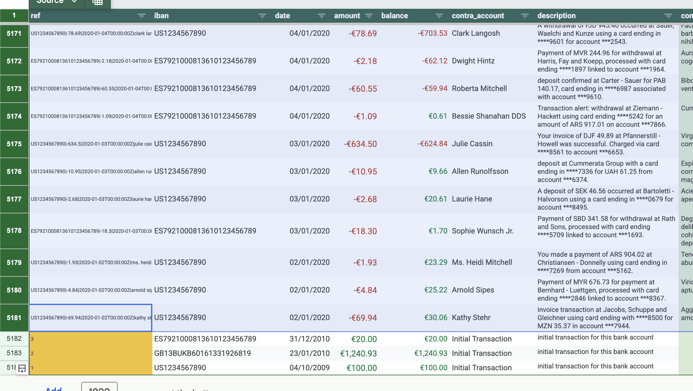
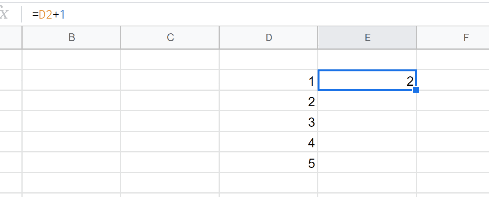
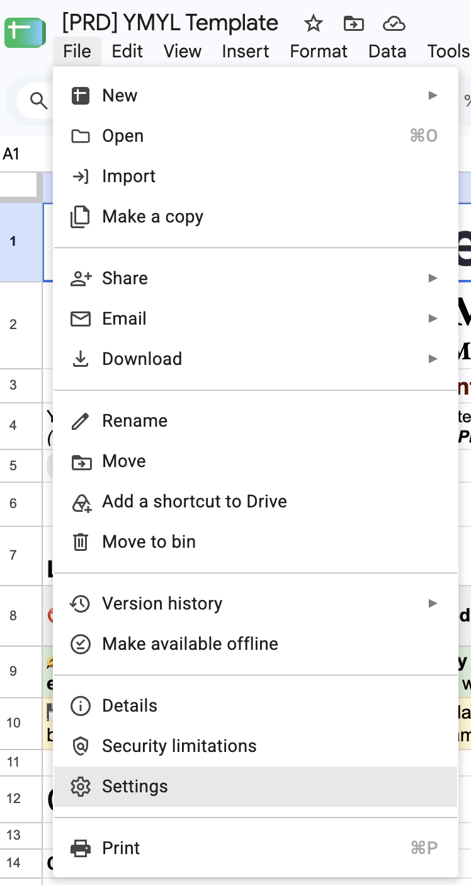
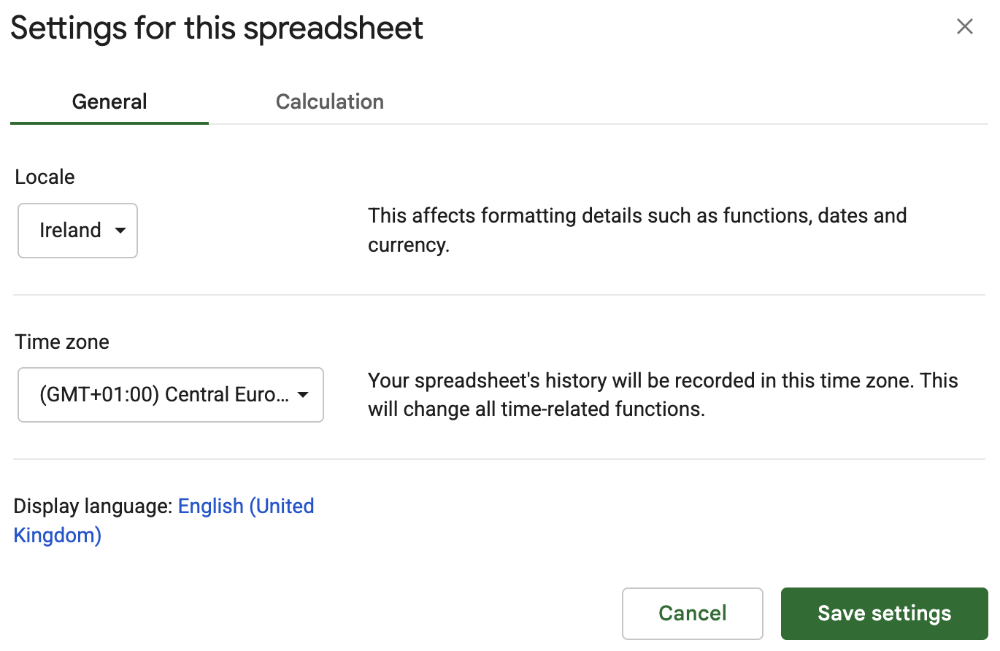

# Initial Setup

Once you've had a chance to explore the dummy data, it's time to set up the spreadsheet for your own personal use.

## 🗑️ Deleting Dummy Data

::: info INFO
This configuration step is manual for now, in future versions a setup wizard will be available.
:::

As you're now using your own data, you'll want to remove the dummy transactions from the **transactions** tab.

Make sure to follow this step carefully as deleting the dummy data is crucial for the spreadsheet to function correctly.

_**⚠️ Important**_: Select all the rows until the very end except for the last 3 rows which will have the first column (A) coloured in dark yellow.

You will want to keep these last 3 rows for 2 reasons:

1. They will be used as the initial transactions for the bank accounts that you will configure later.
2. They will be used as reference when importing data. Meaning that when **autofilling** data for a new transaction, the spreadsheet will use the previous transaction as a reference to autofill the next transaction.

::: details Autofill example
Just to be clear, **autofilling** means using other cells as reference to automatically fill in data for other cells.

:::

## 💱 Setting Your Currency

The spreadsheet template uses **EURO (€)** as the default currency. This is because its whole localization is set to **Ireland** (reason: most applicable to most users, English interface and Euro as currecny). If you wish to use a different currency (e.g. £ or $), you can update the Google Sheets location settings by following the instructions below:

1. In the Google Sheets menu, click on **File > Settings**.
   {width="200px"}
2. Under the **General** tab, change the **Locale** to your country. Feel free to update the timezone setting as well.
   
3. Click **Save settings**.

::: tip ✍️ Note
After changing the locale, you can change the formatting for specific cells (for example, you want a specific column to display £ instead of €) by selecting the cells and going to **Format > Number > Currency**. Or use the **€** (Format as currency) button directly from the ribbon menu.

In a future version, a guided setup will automatically apply your desired currency format across the entire spreadsheet. Meaning no further manual cell-by-cell formatting required.
:::

## 🏦 Adding Your Bank Accounts

Your next step is to configure your bank accounts on the **dashboard** tab.

1. Navigate to the `dashboard` tab.
2. In the **Accounts** section (top left), you'll see a list of dummy banks (e.g. _Commonwealth Bank_, _Barklays_).
3. Replace the dummy names in **Column A** with the actual names of your bank accounts (e.g., "Chase Checking", "Amex Credit Card").
4. Replace the dummy IBANs/Account Numbers in **Column B** with your real account numbers.

> [!IMPORTANT]
> The names of the bank accounts you enter here are critical. They will automatically populate across the rest of the spreadsheet (such as in the `import-settings` tab).

The balances and transaction counts (Columns C through F) will automatically update as you import your transactions in the upcoming steps.

### Updating the initial transactions

Remember the rows you kept at the bottom of the **source** tab when [deleting the dummy data](#🗑%EF%B8%8F-deleting-dummy-data)? Now that your bank accounts are configured, those rows need to be updated to reflect your real accounts:

1. **IBAN / Account number** — Update this column to match the account numbers you entered on the **dashboard** tab.
2. **Amount** — Set this to the **current real balance** of that bank account. This acts as the opening balance and is the baseline from which the spreadsheet calculates running totals as you import future transactions.

Each of the rows corresponds to one of your bank accounts. Make sure every account configured on the dashboard has a matching initial transaction row. You can duplicate the rows to match the number of bank accounts you have.

> [!WARNING]
> It is very important that these initial transactions are correctly set up. Otherwise the balances of bank accounts will not be correct.

At last, your final result should look something like this:

# TODO add image of final setup

<!--  -->

When you've added all your accounts and setup the initial balances _(transactions)_, let's move on to mapping your CSV exports in [Configuring Imports](./import-settings).
